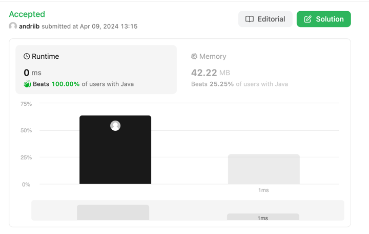
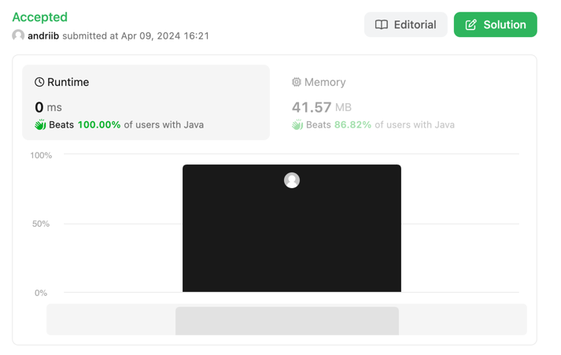
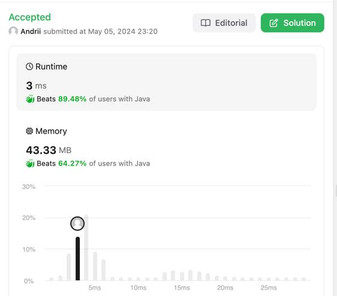

# leetcode-top-interview-150

Solutions for LeetCode's "Top Interview 150 Challenge" https://leetcode.com/studyplan/top-interview-150

## Problem: 88. Merge Sorted Array

* Link to the problem: [link](https://leetcode.com/problems/merge-sorted-array/description)
* Link to the solution: [link](src/main/java/com/leetcode/merge_sorted_arrays_88/Solution.java)
  

## Problem: 27. Remove Element

* Link to the problem: [link](https://leetcode.com/problems/remove-element/description)
* Link to the solution: [link](src/main/java/com/leetcode/remove_element_27/Solution.java)
  

## Problem: 26. Remove Duplicates from Sorted Array

* Link to the problem: [link](https://leetcode.com/problems/remove-duplicates-from-sorted-array/description)
* Link to the solution: [link](src/main/java/com/leetcode/remove_duplicates_from_sorted_array_26/Solution.java)

## Problem: 169. Majority Element

* Link to the problem: [link](https://leetcode.com/problems/majority-element/description)
* Link to the solution: [link](src/main/java/com/leetcode/majority_element_169/Solution.java)

## Problem: 242. Valid Anagram

* Link to the problem: [link](https://leetcode.com/problems/valid-anagram)
* Link to the solution: [link](src/main/java/com/leetcode/valid_anagram_242/Solution.java)
* * Link to the solution: [link](src/main/java/com/leetcode/valid_anagram_242/SolutionFollowUp.java)
